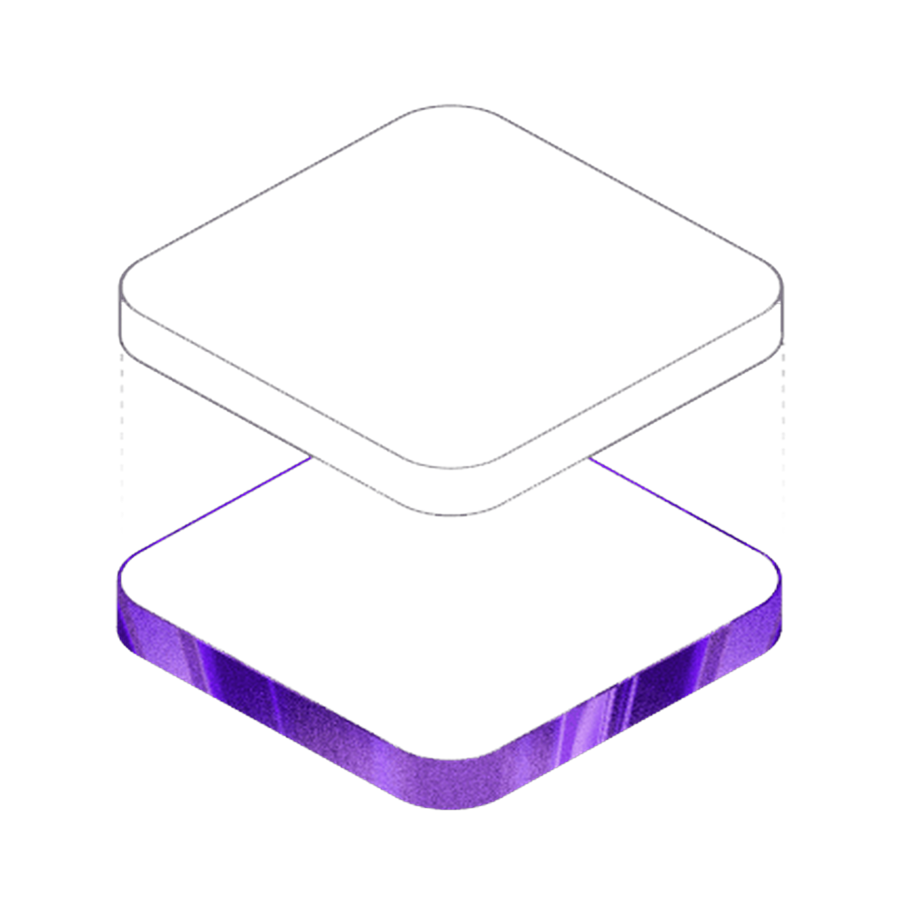
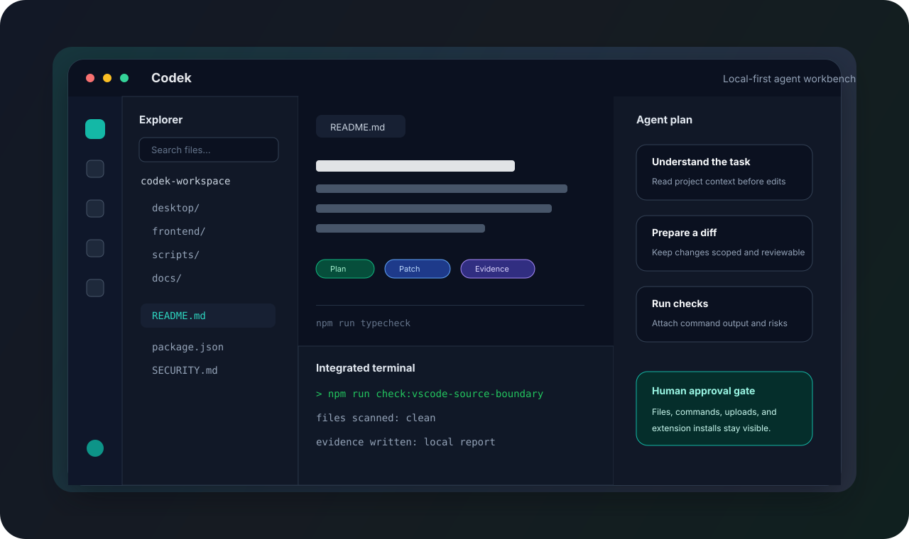
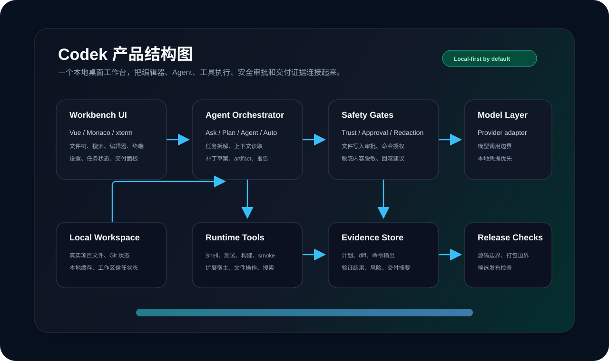
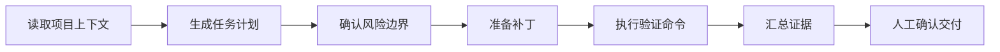

<p align="center">
  
</p>

<h1 align="center">Codek</h1>

<p align="center">
  本地优先的 AI 桌面开发工作台。把编辑器、Agent 计划、命令执行、质量验证和交付证据放在同一个可审计窗口里。
</p>

<p align="center">
  <a href="LICENSE"></a>
  <a href="package.json"></a>
  <a href="frontend/vite-project/package.json"></a>
  <a href="SECURITY.md"></a>
</p>

<p align="center">
  <a href="#界面原型">界面原型</a>
  ·
  <a href="#产品结构">产品结构</a>
  ·
  <a href="#功能介绍">功能介绍</a>
  ·
  <a href="#工作流">工作流</a>
  ·
  <a href="#快速开始">快速开始</a>
  ·
  <a href="#安全与隐私">安全与隐私</a>
</p>



## Codek 是什么

Codek 面向真实工程里的 AI 协作，而不是只把聊天框贴在编辑器旁边。一次有效的 AI 编程通常会跨过多个动作：读项目、拆任务、改文件、跑命令、看失败、修补丁、汇总证据、让人确认。Codek 把这些动作收进桌面工作台，减少“AI 说它做了什么”和“项目里真实发生了什么”之间的断层。

它的核心定位是：

- **本地工作区优先**：项目文件、命令输出、验证报告和运行证据默认围绕本机工作区组织。
- **人类确认优先**：写文件、执行命令、安装扩展、调用外部服务这类高风险动作要可见、可审计、可撤销。
- **工程闭环优先**：不只产出 diff，还要能说明计划、验证命令、失败原因和剩余风险。
- **中文团队友好**：任务说明、质量门结果、风险提示和交付摘要优先服务中文工程协作。

## 界面原型

上方原型图展示的是 Codek 的目标工作台布局。它不是某个用户项目的真实截图，避免把本机路径、源码片段、日志或模型配置放进公开仓库；但它对应的是产品里的真实模块边界。

| 区域 | 作用 | 典型内容 |
| --- | --- | --- |
| Activity Bar | 切换核心工作区 | 文件、搜索、源码管理、扩展、设置、智能助手 |
| Explorer | 管理真实项目文件 | 文件树、过滤、打开文件、工作区状态 |
| Editor | 审阅和编辑代码 | Monaco 编辑器、标签页、diff、Markdown/Notebook 预览 |
| Agent Panel | 控制 AI 协作 | Ask / Plan / Agent / Auto 模式、任务计划、补丁草案、artifact |
| Terminal | 执行验证命令 | 测试、类型检查、构建、smoke、项目脚本 |
| Evidence | 记录交付证据 | 命令输出、诊断、验证摘要、失败原因、风险提示 |

## 产品结构



这张结构图表达的是 Codek 的产品分层：前端工作台负责把文件、编辑器、终端和 Agent 状态放在一个界面里；Agent Orchestrator 负责任务拆解、上下文读取、补丁草案和报告；Safety Gates 把高风险动作变成显式审批；Runtime Tools 连接真实 shell、测试、构建、扩展宿主和文件系统；Evidence Store 保存计划、diff、验证输出和交付摘要。

## 功能介绍

### 1. 本地桌面工作台

Codek 使用 Electron + Vue + Monaco 组织桌面体验，目标是保留开发者熟悉的本地 IDE 操作方式，同时把 AI 协作状态放进同一个产品表面。

- 本地文件树、搜索、编辑器标签页和设置面板。
- Monaco Editor 支持代码编辑、Markdown/Notebook 预览和 diff 审阅。
- 集成终端用于运行项目自己的脚本，而不是把验证留在聊天记录里。
- 工作区状态管理用于跟踪当前项目、信任状态、任务进度和可见风险。

### 2. Agent 协作模式

Codek 把 AI 协作拆成不同强度的模式，让人可以根据风险选择控制粒度。

| 模式 | 适合场景 | 行为边界 |
| --- | --- | --- |
| Ask | 问代码、解释实现、查找路径 | 默认只读，输出分析和建议 |
| Plan | 拆需求、定步骤、列风险 | 生成可执行计划，不直接改文件 |
| Agent | 按任务推进实现 | 读取上下文、准备补丁、运行允许的检查 |
| Auto | 连续处理低风险闭环任务 | 仍受权限、命令和外部上传边界约束 |

### 3. 计划、补丁和 artifact

Agent 不应该只给最终答案。Codek 的协作面板会围绕一次任务保留中间产物：

- 任务目标、约束、验收标准和风险。
- 涉及文件、模块和预计改动范围。
- 补丁草案、变更摘要和回滚建议。
- 生成的 artifact、报告、检查结果和交付说明。

这些内容让开发者可以在 AI 继续执行前看到它的意图，也方便在任务结束后复盘。

### 4. 质量门和验证证据

Codek 把测试、类型检查、构建、smoke 和源码边界检查视为交付的一部分，而不是额外步骤。

- 前端类型检查、lint、Vitest 和 UI smoke 可以作为任务验证证据。
- 桌面服务测试、Electron smoke、打包 smoke 和发布候选检查可接入交付摘要。
- 验证失败时保留失败命令、错误摘要、下一步建议和剩余风险。
- 最终交付不只写“已完成”，而是写清楚“跑了什么、通过什么、没验证什么”。

### 5. 权限、沙箱和审计

Codek 把文件写入、终端命令、扩展安装、模型调用和外部上传当作高风险动作处理。

- 高风险动作在执行前应可见。
- 命令、结果和关键决策应进入证据链。
- 日志和报告避免保存不必要的源码正文、prompt/response 正文、token、私钥或完整隐私路径。
- 不同平台的隔离能力不同，发布前需要结合安全文档和验证脚本确认真实边界。

### 6. VS Code 生态适配

仓库包含 VS Code 相关源码子集和适配层，用于补齐编辑器、工作台、扩展宿主和工程工具能力。Codek 不是简单换壳：它在成熟编辑器底座上增加 Agent 流程、安全审批、证据链和中文协作体验。

## 工作流



一次典型协作会这样推进：

1. 开发者描述目标，Codek 先读取相关文件和项目脚本。
2. Agent 生成计划，列出预计改动范围、验证方式和风险。
3. 人确认后，Agent 准备补丁并在工作台里暴露 diff。
4. Codek 运行类型检查、测试、构建或 smoke，把输出写进证据摘要。
5. 如果失败，Agent 回到定位和修复；如果通过，生成可审阅的交付说明。

## 技术栈

| 层 | 技术 |
| --- | --- |
| Desktop | Electron 35、Node.js、本机服务、打包脚本 |
| Frontend | Vue 3、Vite、Pinia、Monaco Editor、xterm.js |
| Validation | Node test、Vitest、vue-tsc、smoke scripts、源码边界检查 |
| Source Adapter | VS Code 相关源码子集、扩展宿主与工作台能力适配 |

## 快速开始

```powershell
npm install
cd desktop
npm install
cd ..
npm run doctor -- --clean-clone
npm run build
npm run start
```

常用验证命令：

```powershell
npm run typecheck
npm run check:vscode-source-boundary
git diff --check
node scripts/frontend-dist-consistency.js
```

## 项目结构

```text
desktop/               Electron 主进程、预加载脚本、桌面服务和打包配置
frontend/vite-project/ Vue 前端工作台
scripts/               构建、验证、smoke、发布候选和迁移检查脚本
docs/                  发布、运行时边界和源码迁移说明
vendor/vscode/         用于适配和迁移验证的 VS Code 相关源码子集
```

## 项目状态

Codek 当前以公开预览形态保留源码、设计说明和可下载安装包。由于资金和时间限制，项目暂时没有继续完善到长期维护和稳定商业分发状态；后续在资金与时间条件充足时，会重启项目并继续补齐产品体验、稳定性验证、跨平台打包、签名更新和生态兼容工作。

当前公开版本适合用于源码审阅、技术参考和本机试用，不应被理解为已经完成长期维护承诺的稳定正式版。

## 发布与分发

本仓库目前更适合源码审阅、工程验证和本机试用。安装包、签名、自动更新、扩展市场兼容性和跨平台体验应在对外分发前按发布检查清单逐项验证。

- [发布运行手册](docs/RELEASE_RUNBOOK.md)
- [试用检查清单](docs/BETA_TRIAL.md)
- [打包运行时边界](docs/PACKAGING_RUNTIME_SOURCE_BOUNDARY.md)

## 安全与隐私

- API key、Bearer token、SSH key、证书、私钥和 `.env` 文件不得提交到仓库。
- 模型 Provider 凭据只应放在本机环境变量、系统凭据存储或明确标记为本地的配置中。
- 报告和日志不应保存用户源码正文、prompt/response 正文、私钥、token 或不必要的完整隐私路径。
- 扩展安装、命令执行、文件写入和模型调用都属于高风险动作，需要保留可审计记录。

更多见 [SECURITY.md](SECURITY.md)、[PRIVACY.md](PRIVACY.md) 和 [THIRD_PARTY_NOTICES.md](THIRD_PARTY_NOTICES.md)。
